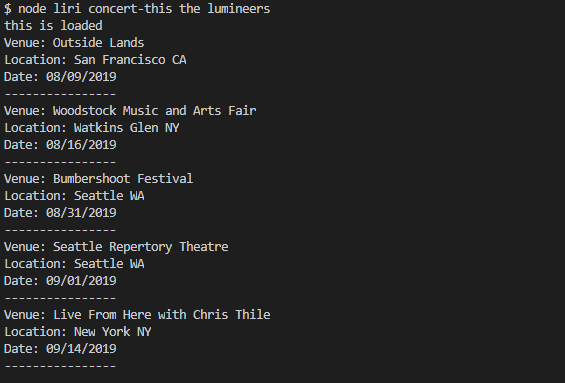
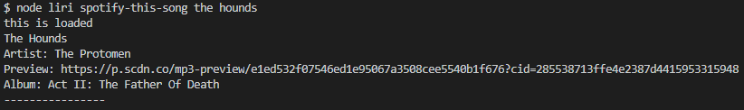
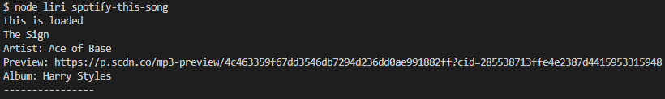
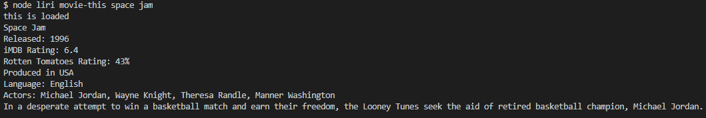
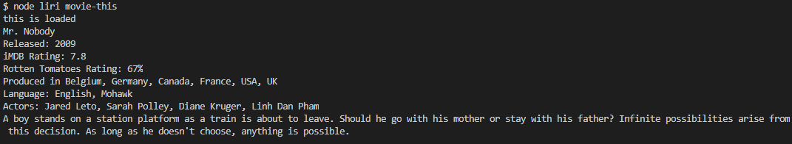
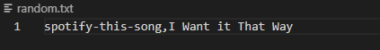
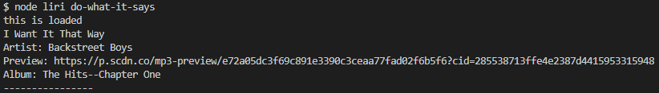
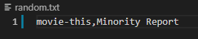
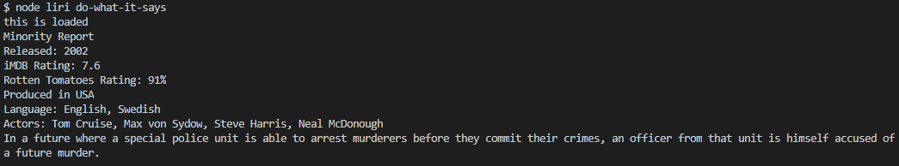

# LIRI Node App

## Description

This Node-based application takes commands and parameters and queries various APIs to return a response. It can retrieve information about upcoming concerts, specified songs, and films.

### Before Using

First, install the required node packages using "npm install".

As this app uses the dotenv package to store its Spotify API keys, you will need to:

* Sign up as a developer for a free or paid Spotify account.

   1. Visit <https://developer.spotify.com/my-applications/#!/>

   2. Either login to your existing Spotify account or create a new one (a free account is fine) and log in.

   3. Once logged in, navigate to <https://developer.spotify.com/my-applications/#!/applications/create> to register a new application to be used with the Spotify API. You can fill in whatever you'd like for these fields. When finished, click the "complete" button.

   4. On the next screen, scroll down to where you see your client id and client secret.

* Create a ".env" file in the main directory. Inside, copy the following, replacing the placeholder values with your own credentials.:

SPOTIFY_ID=your-spotify-id
SPOTIFY_SECRET=your-spotify-secret

## Using the App

The app takes requests in the form of:

*node liri command parameter*

where the command is one of the following:

#### concert-this

This command will return the next five concerts scheduled to be performed by the specified band or artist, sorted by most recent. It will also return the location and date.

#### spotify-this-song

This command returns information about a specified music track, including the artist, the album the song is from, and a link to a preview, if available.

If no song is specified, its response will default to "The Sign" by Ace of Base.

#### movie-this

This command returns information about the specified movie, including the year it was released, its iMDB and Rotten Tomatoes ratings, country of production, language, and actors.

If no movie is specified, its response will default to "Mr. Nobody".

#### do-what-it-says

This command requires no second argument, and instead retrieves its arguments from the "random.txt" file in the directory. By default, this is set to run the spotify-this-song command on the song "I Want It That Way".

However, this can be changed to anything the user might want, as demonstrated below.

### Node Modules Used

*axios
*dotenv
*moment
*node-spotify-api

### Author

Colin Elving

https://github.com/celving